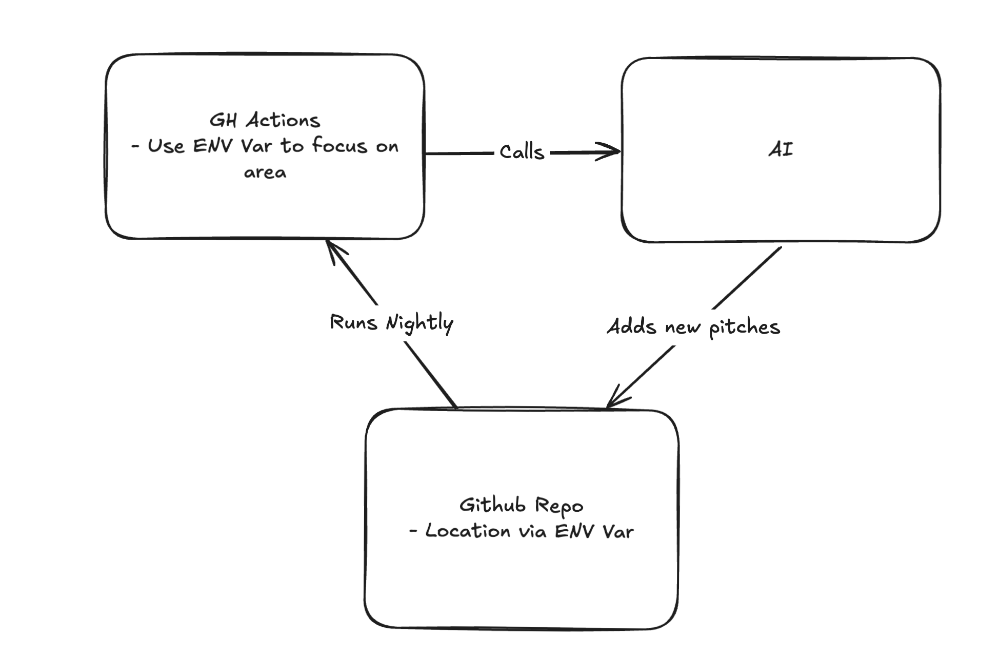

## Problems
This repo contains a list of major problems for a particular area. The intent is to be a place to go to find "work" to do in that area that is meaningful.

### Definitions
- *Problem*: An issue that Washington DC faces such as climate change or mental health concern or poverty.
- *Pitch*: Each problem may have different "Pitches" associated to them. These roughly align to a ["shape-up pitch"](https://basecamp.com/shapeup). These contain small descriptions of the problem, the scope of the pitch, some data describing how this pitch will help, andd the solution. A pitch could belong to multiple problems. Generally pitches should take a small team of people 2-8 weeks to complete. E.g. A coffee shop helps prevent loneliness, and fights poverty with jobs. Each pitch should have opportunities to help people find grants, competitions (e.g. a competition for how to grow tomatoes with less waste), or other monetary opportunities (e.g. a coffee shop would provide monetary opportunity for a business owner).

### Why this helps
This seems like a pretty basic project but what makes this interesting is that it will be AI shepherded. At different intervals, jobs will run that could:
- add more pitch ideas
- analyze user created pitches and provide feedback via pull requests
- find associated opportunities

### Diagram

